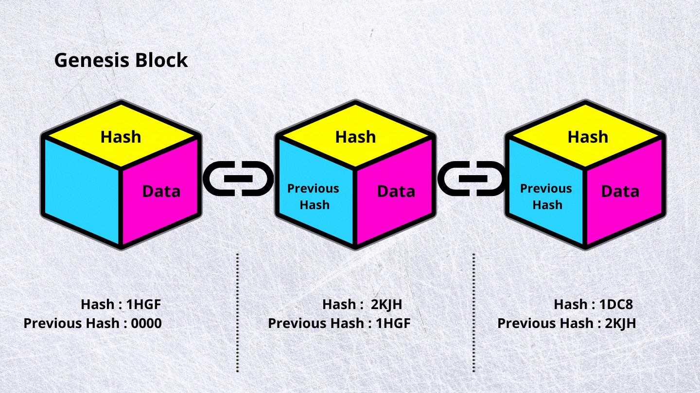

<h1 align="center">Example of blockchain on Python 🐍</h1>

<hr>

<p align="center">The principle of operation of the blockchain</p>

<p align="center">

</p>


```python

hashed_block = 0

hashed_block2 = hashed_block + hash(hashed_block) #  you can add other data (not principal)

hashed_block3 = hashed_block2 + hash(hashed_block2) # and etc.

```

<hr>

<p align="center">

</p>
<small>
<p>
Creating genesis-block...
</p>

<p>
Genesis-block:  {'index': 0, 'previous_hash': '0', 'timestamp': 1722319063, 'data': 'Genesis Block', 'hash': '1284211130bd09b760a296e8b8c961468f825dae4b9c364a49b7ded6fd7d39fb'}

<p>
Adding blocks to the chain...
<p>
{'index': 0, 'previous_hash': '0', 'timestamp': 1722319063, 'data': 'Genesis Block', 'hash': '1284211130bd09b760a296e8b8c961468f825dae4b9c364a49b7ded6fd7d39fb'}
<p>
{'index': 1, 'previous_hash': '1284211130bd09b760a296e8b8c961468f825dae4b9c364a49b7ded6fd7d39fb', 'timestamp': 1722319063, 'data': 'First block after genesis', 'hash': 'd9bc24706f881ff486c42c1850fedd899fc88472328f63cbe827752a186d2d46'}
<p>
{'index': 2, 'previous_hash': 'd9bc24706f881ff486c42c1850fedd899fc88472328f63cbe827752a186d2d46', 'timestamp': 1722319063, 'data': 'Second block after genesis', 'hash': '980f38c82de7e9caf5f26e971b9805e1bab678404352735124c28e50c6c3f0ef'}
<p>
{'index': 3, 'previous_hash': '980f38c82de7e9caf5f26e971b9805e1bab678404352735124c28e50c6c3f0ef', 'timestamp': 1722319063, 'data': 'Third block after genesis', 'hash': '4b0686ed403fb184c590a8519cfd6e8bb881e75b6dfa607a3a6313ba39d390cd'}
<p>
Chain integrity check:  True
</small>
